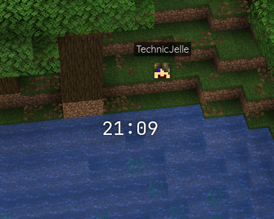

# BlueMap Time Marker

Adds a marker showing the time to [BlueMap](https://github.com/BlueMap-Minecraft/BlueMap).

Compatible with Paper 1.13+, Java 25+.

To reload this plugin, just reload BlueMap itself with `/bluemap reload`.

## [Click here to download!](../../releases/latest)

## Support

To get support with this plugin, join the [BlueMap Discord server](https://bluecolo.red/map-discord)
and ask your questions in [#3rd-party-support](https://discord.com/channels/665868367416131594/863844716047106068).
You're welcome to ping me, @TechnicJelle.
